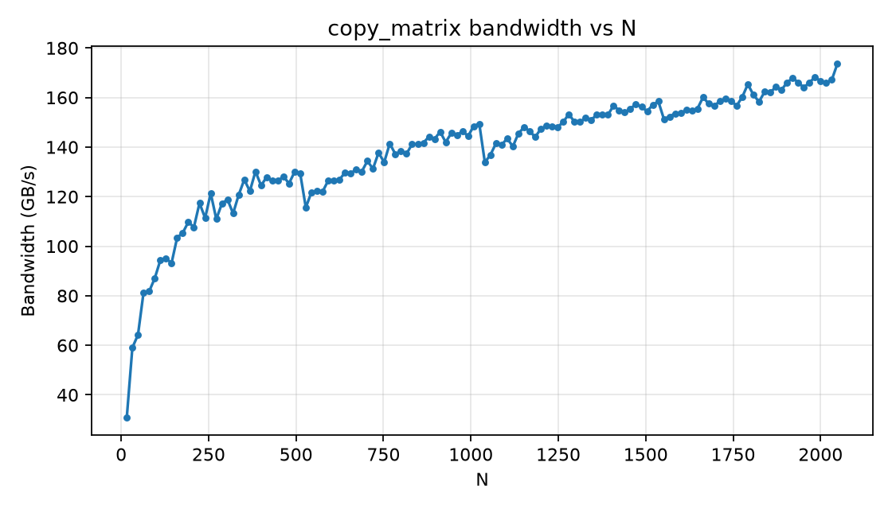

GPU Architecture and cuTile
============================

.. _gpu_properties:

Task 1: GPU Device Properties
------------------------------

Using the given function, we obtained the following information about the GPU device:

.. code-block:: text

    L2CacheSize: 24.00 MiB
    MaxSharedMemoryPerMultiprocessor: 100.0 KiB
    ClockRate: 2.418 GHz

Task 2: Matrix Reduction Kernel
--------------------------------

In this task, we had to write a cuTile kernel that reduces a 2D input matrix of arbitrary shape (M, K) 
along its last dimension (K), producing a 1D output vector of shape (M,) that contains the per-row sum.
For the reduction, the kernel relies on `ct.sum` to perform the summation of elements along the specified dimension:

.. literalinclude:: ../../../src/assignments/02_assignment/task-02.py
    :language: py
    :linenos:
    :lines: 8-17
    :caption: `Kernel for matrix reduction using ct.sum.`

Since we only tile in the M dimension, we use a 1D grid.

The kernel is launched using a utility function, which also pads the number of columns (K) to the nearest multiple of 2:

.. literalinclude:: ../../../src/assignments/02_assignment/task-02.py
    :language: py
    :linenos:
    :lines: 20-38
    :caption: `Launching the reduction kernel with appropriate tile size and grid dimensions.`

Next, to verify the correctness of the kernel, we compare its output with the result obtained from PyTorch's built-in reduction function:

.. literalinclude:: ../../../src/assignments/02_assignment/task-02.py
    :language: py
    :linenos:
    :lines: 41-49
    :caption: `Testing the reduction kernel by comparing its output with PyTorch's torch.sum result.`

Since we only tile in the M dimension, parallelism is only achieved across the rows of the input matrix.
If we increase the M dimension, more tiles will be launched, potentially allowing for better utilization of the GPU's resources and thus improving performance. 
However, since we are not tiling in the K dimension, the performance may not scale well with larger K values. 
Each thread will still have to process a large number of elements sequentially.

Task 3: 4D Tensor Element-wise Addition
----------------------------------------

In this task, we implemented a cuTile kernel that adds two 4D tensors A and B element-wise and stores the result in C. 
Note that all tensors have identical shape and dimensions (M, N, K, L).

Part of the task was to implement two kernels, where one tiles over the K and L dimensions, and the other tiles over the M and N dimensions:

.. literalinclude:: ../../../src/assignments/02_assignment/task-03.py
    :language: py
    :linenos:
    :lines: 18-38
    :caption: `Kernel for element-wise addition of two 4D tensors with tiling over K and L dimensions.`

.. literalinclude:: ../../../src/assignments/02_assignment/task-03.py
    :language: py
    :linenos:
    :lines: 41-61
    :caption: `Kernel for element-wise addition of two 4D tensors with tiling over M and N dimensions.`

In both kernels, we access the tiles using a 2D grid and simply add up the tiles. 
In addition to the tensors, the kernels also take the tile sizes as constant input parameters.
Similarly to the previous task, we launch the kernels using a utility function that pads the dimensions of the input tensors to the nearest multiple of the tile sizes:

.. literalinclude:: ../../../src/assignments/02_assignment/task-03.py
    :language: py
    :linenos:
    :lines: 64-85
    :caption: `Launching the element-wise addition kernel.`

The function for launching the second kernel is very similar, with the only two differences being that we first compute `tM` and `tN` instead of `tK` and `tL` 
and then use `K` and `L` instead of `M` and `N` for the grid dimensions.

Next, we verify the correctness of both kernels by comparing their outputs with the result obtained from PyTorch's built-in addition operation:

.. literalinclude:: ../../../src/assignments/02_assignment/task-03.py
    :language: py
    :linenos:
    :lines: 112-119
    :caption: `Testing the element-wise addition kernel.`

Lastly, we analyze the performance of both kernels by benchmarking the addition of matrices of shape (16, 128, 16, 128).
For measuring the time per kernel execution, we use `triton.testing.do_bench` with a warmup time of 0.2 seconds and a repetition time of 2 seconds:

.. literalinclude:: ../../../src/assignments/02_assignment/task-03.py
    :language: py
    :linenos:
    :lines: 132-176
    :caption: `Benchmarking both element-wise addition kernel.`

We obtained the following results on the DGX Spark:

.. code-block:: text

    Benchmark (ms per launch):
        cuTile KL-tiling: 0.1386 ms
        cuTile MN-tiling: 0.4787 ms
        torch.add: 0.1385 ms

We can see that the kernel that tiles over the K and L dimensions performs on par with PyTorch's built-in addition operation, 
while the kernel that tiles over the M and N dimensions is significantly slower.
We can assume that PyTorch uses a similar tiling strategy as the first kernel, which is why it achieves similar performance.
The second kernel, on the other hand, shows that tiling over the M and N dimensions is not as efficient for this particular operation, 
likely due to less optimal memory access patterns and reduced parallelism.

Task 4: Benchmarking Bandwidth
------------------------------

The goal of this task was to benchmark the bandwidth of the GPU by copying tensors of sizes `16, 32, 64 and 128`.
Since we only do a copy operation, the kernel is rather simple:

.. literalinclude:: ../../../src/assignments/02_assignment/task-04.py
    :language: py
    :linenos:
    :lines: 12-23
    :caption: `Kernel for copying a tensor from input to output.`

The kernel is launched using a simple utility function as well, without any manual padding:

.. literalinclude:: ../../../src/assignments/02_assignment/task-04.py
    :language: py
    :linenos:
    :lines: 26-41
    :caption: `Launching the copy kernel.`

Next, we define a test function to verify the correctness of the copy kernel by comparing its output with the input tensor:

.. literalinclude:: ../../../src/assignments/02_assignment/task-04.py
    :language: py
    :linenos:
    :lines: 44-51
    :caption: `Testing the copy kernel by comparing its output with the input tensor.`

Lastly, we benchmark the bandwidth of the GPU by copying tensors of varying sizes and measuring the time taken for each copy operation.
Furthermore, we collect the achieved bandwidth in GB/s for each tensor size and plot the results:

.. literalinclude:: ../../../src/assignments/02_assignment/task-04.py
    :language: py
    :linenos:
    :lines: 54-92
    :caption: `Benchmarking the bandwidth of the GPU by copying tensors of varying sizes and plotting the results.`

The generated plot shows the achieved bandwidth in GB/s for different tensor sizes:

