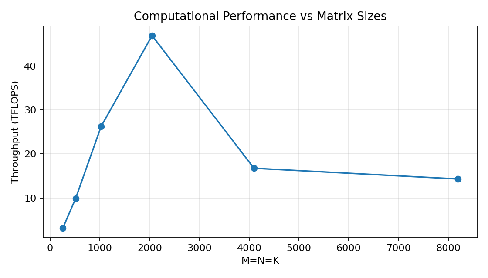
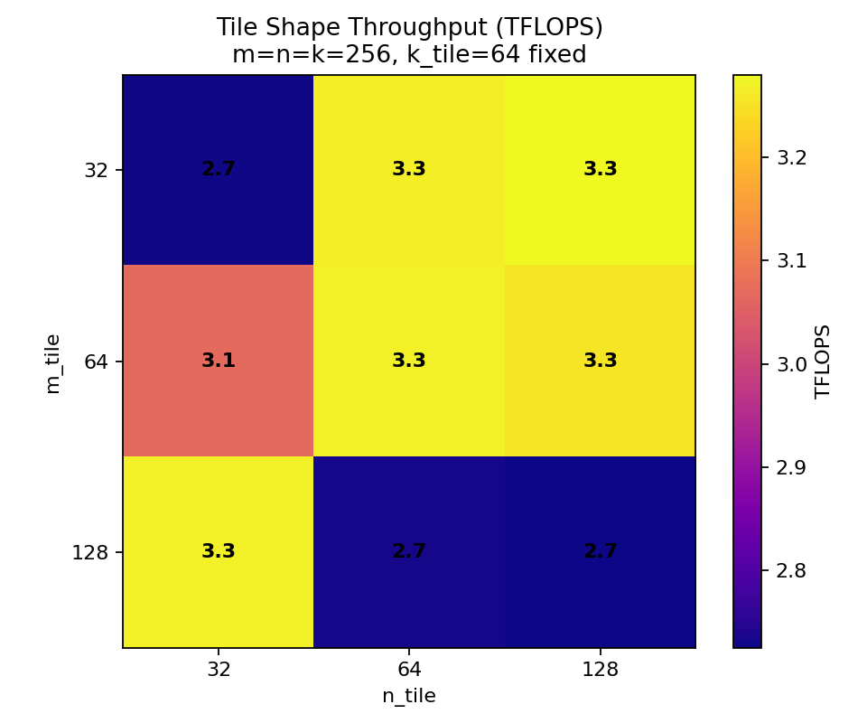
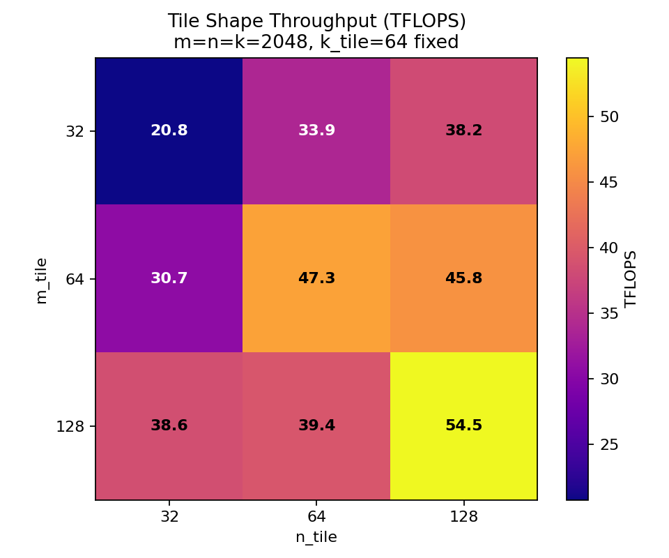

Matrix Multiplication with cuTile
=================================

Task 1: FP32 vs FP16 Performance
--------------------------------

Our ``FP16`` and ``FP32`` kernels are implemented equally:

.. literalinclude:: ../../../src/assignments/03_assignment/task-01.py
    :language: py
    :linenos:
    :lines: 14-24
    :caption: `FP16 kernel for matrix multiplication`

After implementing both, the ``FP16`` and the ``FP32`` kernel, we measured the following execution times:

.. code-block:: text

    Benchmark (ms per launch):
        FP16 time: 0.028004568445800248
        FP32 time: 1.7323399588076567

These measurements show that the speedup of the ``kernel_fp16`` over ``kernel_fp32`` is about ``87``.
This shows that performing calculations at a lower precision results in significant performance gains.

Task 2: Simple Matrix Multiplication
------------------------------------

Implementing the matrix multiplication kernel using ``ct.mma``, we followed the provided instructions. 

1. The two input matrices ``A`` and ``B`` are created with dimensions in the range from ``1`` to ``4096``.
2. Our grid depends on the amount of tiles for the ``n`` and ``m`` dimension.

.. literalinclude:: ../../../src/assignments/03_assignment/task-02.py
    :language: py
    :linenos:
    :lines: 58
    :caption: `1d grid`

3. The kernel itself uses the block id to calculate the ``row`` and ``column`` according to a row-major format.
   By adding the padding mode to the ``ct.load`` operations, we are also handling matrix sizes that are not powers of 2.

.. literalinclude:: ../../../src/assignments/03_assignment/task-02.py
    :language: py
    :linenos:
    :lines: 18-35
    :caption: `Simple matrix multiplication kernel`

Task 3: Benchmarking the Matrix Multiplication Kernel
-----------------------------------------------------

Benchmarking the matrix multiplication kernel has been approached via a loop over the different matrix sizes and the different tile shapes.
The results for the different squared matrices can be found in ``task3_matrix_sizes.png``.

These measurements show that the peak computational throughput can be achieved with matrices around a squared size of ``2048`` for a fixed tile shape of ``(64, 64, 64)``.
For larger matrices the throuphput reduces from around ``48 TFLOPS`` to ``18 TFLOPS`` and reduces even further with increasing dimension sizes. 
This indicates that these fixed tile shapes can be useful for smaller matrix sizes (up to `\approx` ``2048``), while for larger matrix sizes different / larger tile shapes might perform better. 

In the second benchmark we initially measured the ``TFLOPS`` for all 27 possible tile shapes and stored the results in respective ``csv`` files for the ``256`` and the ``2048`` matrices.
It can be clearly seen that the throughput for the larger matrices is significantly higher.

In regards to the best-performing tile shape combination the results also differ from one other. 
For the ``256``x``256`` matrices there are several tile shapes with similar throughput values:

1.  ``tM=32``, ``tN=128``,  ``tK=64``, ``3.2799 TFLOPS``
2.  ``tM=64``,  ``tN=64``, ``tK=128``, ``3.2769 TFLOPS``
3.  ``tM=64``, ``tN=128``, ``tK=128``, ``3.2737 TFLOPS``
4.  ``tM=32``, ``tN=128``, ``tK=128``, ``3.2731 TFLOPS`` 
5. ``tM=128``,  ``tN=64``, ``tK=128``, ``3.2711 TFLOPS``

All of the values above have roughly a throughput of ``3.27 TFLOPS``. 

For the ``2048``x``2048`` matrices the distinction between the results are more significant:

1. ``tM=128``, ``tN=128``,  ``tK=64``, ``54.4815 TFLOPS``
2. ``tM=128``,  ``tN=64``, ``tK=128``, ``51.8625 TFLOPS``
3.  ``tM=64``, ``tN=128``, ``tK=128``, ``49.8584 TFLOPS``
4.  ``tM=64``, ``tN=128``,  ``tK=32``, ``47.4245 TFLOPS``
5.  ``tM=64``,  ``tN=64``,  ``tK=64``, ``47.3441 TFLOPS``

If we cross-reference these results the tile shape that performs best on average is ``(128, 64, 128)``, ranking 5th and 2nd in both measurements. 
