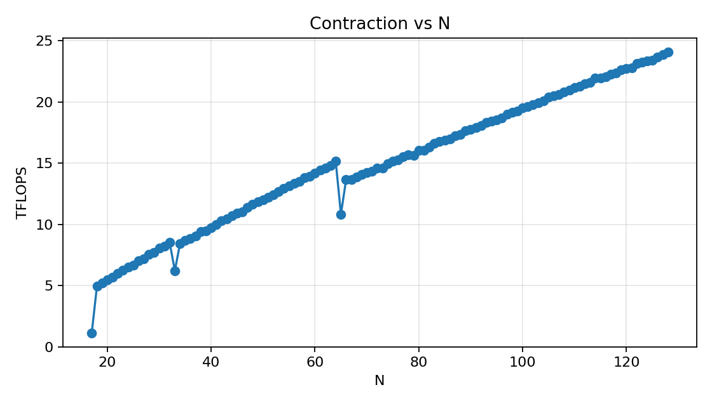
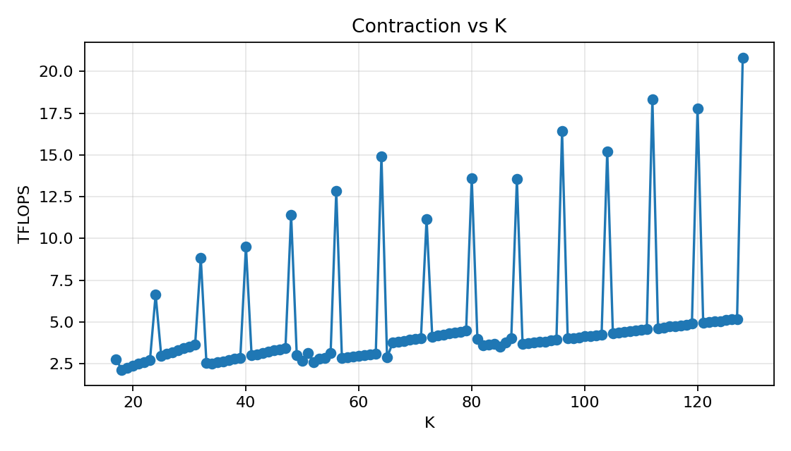

Tensor Contractions on GPUs
===========================

Task 1: Tiled Contraction Kernel Variants
-----------------------------------------

a) Dimension Classification
^^^^^^^^^^^^^^^^^^^^^^^^^^^^^

The dimensions for the einsum string ``eabklxy, ecklyz -> eabcxz`` are classified as follows:

- ``M``: ``a``, ``b``, ``x``
- ``N``: ``c``, ``z``
- ``K``: ``k``, ``l``, ``y``
- ``C``: ``e``

.. _task_1b:

b) cuTile Kernel: Sequentialize over ``k`` and ``l``
^^^^^^^^^^^^^^^^^^^^^^^^^^^^^^^^^^^^^^^^^^^^^^^^^^^^^

We create three tensors ``A``, ``B``, and ``C`` with random dimension sizes and values. 
For that we use a ``tensor_initialization()`` function that creates these tensors for us:

.. literalinclude:: ../../../src/assignments/04_assignment/utils.py
    :language: py
    :linenos:
    :lines: 13-48
    :caption: `Function to initialize three random tensors`

Inside this function we have a check that prevents us to create three tensors that exceed the memory limit of ``32 GiB``.
If our tensors exceed the limit, we simply generate a new random dimension size based on the current value. 
As this procedure is wrapped inside a ``while``-loop we guarantee to be within the memory limit. 

The actual task was solved by creating a ``1D``-grid over the whole ``C`` tensor.

.. literalinclude:: ../../../src/assignments/04_assignment/task-01.py
    :language: py
    :linenos:
    :lines: 54-61
    :caption: `Grid creation and kernel launch`

Based on this grid it was then possible to retrieve the block IDs of the respective dimensions involved in the computation.

.. _1b_bid:

.. literalinclude:: ../../../src/assignments/04_assignment/task-01.py
    :language: py
    :linenos:
    :lines: 17-33
    :caption: `Block ID computation`

The block ID compuation follows a simple principle. 
As the fast dimension is the rightmost dimension in the einsum string, we start with index ``z`` and compute the block ID of ``z`` with the retrieved ``bid = ct.bid(0)``.
After computing the index, we reduce ``bid`` by the number of tiles we have for dimension ``z``.

This concludes one iteration. 
We repeat this for every single index, going from left to right:

1. ``z``
2. ``x``
3. ``c``
4. ``b``
5. ``a``
6. ``e``

After retrieving these indices we set up our **GEMM**:

.. literalinclude:: ../../../src/assignments/04_assignment/task-01.py
    :language: py
    :linenos:
    :lines: 37-51
    :caption: `GEMM computation`

Due to the reason that the ranks of tensor ``A`` and tensor ``B`` (and ``C``) where not matching we decided to create an accumulation matrix ``acc`` of the shape ``(tM, tN)``.
The next thing we did was to set up the sequential ``K``-type loops over ``k``, ``l``, and ``y``, while ``y`` is only needed for the case that :math:`tK < y`.
As we had to create the accumulation with a new shape, we were forced to also reshape the loaded tiles from tensor ``A`` and ``B``. 

After going through all of the loops sequentially we then reshape our accumulated tensor back to the original shape, in order to store the result in our ``C`` tensor.

c) cuTile Kernel: Sequentialize over ``k``, ``l`` and ``b``
^^^^^^^^^^^^^^^^^^^^^^^^^^^^^^^^^^^^^^^^^^^^^^^^^^^^^^^^^^^^

To additionally sequentialize the we first changed the grid by extracting the ``b`` dimension from the calculation.

.. literalinclude:: ../../../src/assignments/04_assignment/task-01.py
    :language: py
    :linenos:
    :lines: 106-113
    :caption: `Grid creation and kernel launch`

Reducing the grid dimension also means that we need to change the index calculation, as we don't need to calculate the ``b`` block ID any more.

.. literalinclude:: ../../../src/assignments/04_assignment/task-01.py
    :language: py
    :linenos:
    :lines: 71-84
    :caption: `Block ID computation`

In regards to the computation we add a new loop for the ``b`` dimension and also move the creation of the ``acc`` tile inside that loop.

.. literalinclude:: ../../../src/assignments/04_assignment/task-01.py
    :language: py
    :linenos:
    :lines: 86-101
    :caption: `GEMM computation`

To find one dimension configuration where the kernel from :ref:`Task 1b) <task_1b>` performed better, we did not need to experiment too much.
One possible configuration is ``(e=8, a=8, b=16, c=8, k=8, l=16, x=16, y=16, z=16)``.

On the other hand to find a kernel where the implementation of Task 1c) was better, was harder. 
Our approach was too equally distribute the workload by sharing the output over the 48 streaming multiprocessors.
Further, we made sure that the ``b`` dimension is odd. 
Finally we found a dimension configuration where the kernel from Task 1c) was slightly better: ``(e=16, a=8, b=5, c=6, k=8, l=8, x=8, y=8, z=8)``.

.. _1c_bench:

.. code-block:: text
    
    [expected 1b > 1c > 1d]
      total memory: 0.07421875GiB
      grid: 1b=32768 blocks, 1c=2048 blocks, 1d=32768 blocks
      tile: tM=8, tN=8, tK=8
      1b=46.091ms  1c=47.734ms  1d=213.975ms
      Ranking: 1b > 1c > 1d
    [expected 1c > 1b]
      total memory: 0.00653076171875GiB
      grid: 1b=15360 blocks, 1c=3072 blocks, 1d=15360 blocks
      tile: tM=4, tN=4, tK=4
      1b=5.898ms  1c=5.863ms  1d=8.908ms
      Ranking: 1c > 1b > 1d

d) cuTile Kernel: GEMM Dimensions ``xyzl``
^^^^^^^^^^^^^^^^^^^^^^^^^^^^^^^^^^^^^^^^^^

In order for us to use the dimensions ``xyzl`` as GEMM dimensions, we switch back to the grid from :ref:`Task 1b) <task_1b>`.
Further, we prepare the tensors ``A`` and ``B``. 

For tensor ``A`` we perform a permutation to change the dimensionality to ``eabklxy -> eabkxly`` and then we reshape the tensor accordingly.
On the other hand, tensor ``B`` can be directly reshaped. 

.. literalinclude:: ../../../src/assignments/04_assignment/task-01.py
    :language: py
    :linenos:
    :lines: 163-183
    :caption: `Permute and reshape for A and B`

We also switch back to the :ref:`block ID computation <1b_bid>` from Task 1b). 
What changes is the way our kernel computes, as we combine the ``l`` and ``y`` dimension to ``ly``.
By combining them we essentially compute a ``xyzl`` GEMM.

.. literalinclude:: ../../../src/assignments/04_assignment/task-01.py
    :language: py
    :linenos:
    :lines: 141-155
    :caption: `xyzl GEMM`

Similarly to `Task 1c) <1c_bench>` we could use the same dimension configuration to outperform the kernel from Task 1d) with the kernel from Task 1b).

To find a dimension configuration where the kernel from Task 1d) outperforms the kernel from Task 1b) we reduced the size of the kernel ``xyzl`` compared to the remaining dimensions.
The idea was to make the workload big enough for the kernel from Task 1d) to be equally utilized as the kernel from Task 1b), while performing less kernel calls.

.. code-block:: text
    
    [expected 1b > 1c > 1d]
      total memory: 0.07421875GiB
      grid: 1b=32768 blocks, 1c=2048 blocks, 1d=32768 blocks
      tile: tM=8, tN=8, tK=8
      1b=46.091ms  1c=47.734ms  1d=213.975ms
      Ranking: 1b > 1c > 1d
    [expected 1d > 1b]
      total memory: 0.009567663073539734GiB
      grid: 1b=151200 blocks, 1c=15120 blocks, 1d=151200 blocks
      tile: tM=2, tN=2, tK=2
      1b=28.395ms  1c=28.570ms  1d=25.887ms
      Ranking: 1d > 1b > 1c

e) cuTile Kernel: 3D GEMM Kernel using ``exyz``
^^^^^^^^^^^^^^^^^^^^^^^^^^^^^^^^^^^^^^^^^^^^^^^

Creating a 3D ``exyz`` GEMM kernel we first permuted our tensors by moving the ``e`` dimension closer to the right:

.. literalinclude:: ../../../src/assignments/04_assignment/task-01.py
    :language: py
    :linenos:
    :lines: 232-238
    :caption: `Tensor permutations`

Secondly, we introduced a new tile size called ``tC`` which is used for tiling the ``e`` dimension.
Therefore, our grid changed as well.

.. literalinclude:: ../../../src/assignments/04_assignment/task-01.py
    :language: py
    :linenos:
    :lines: 240-246
    :caption: `Grid computation and kernel launch`

Inside the kernel we adjust the block ID calculation slightly, because of the positioning of dimension ``e`` and the new tile shape ``tC``. 

.. literalinclude:: ../../../src/assignments/04_assignment/task-01.py
    :language: py
    :linenos:
    :lines: 193-209
    :caption: `Block ID computation`

To perform a correct 3D GEMM we also change the indices and shapes for the tiles of ``A``, ``B``, ``acc`` and ``C``.

.. literalinclude:: ../../../src/assignments/04_assignment/task-01.py
    :language: py
    :linenos:
    :lines: 211-226
    :caption: `exyz GEMM`

The last thing is to bring the output matrix ``C`` back into its normal shape. 

.. literalinclude:: ../../../src/assignments/04_assignment/task-01.py
    :language: py
    :linenos:
    :lines: 248-249
    :caption: `Restore shape of C`

Task 2: Fused vs. Separate Elementwise Multiplication
-------------------------------------------------------

a) Implementing the Fused Kernel
^^^^^^^^^^^^^^^^^^^^^^^^^^^^^^^^^^

As a starting point, we used the kernel from Task 1b) and added another input tensor ``D`` to both the kernel and the kernel launch functions.
After the loops for the contraction, we load a tile from tensor ``D`` and perform the elementwise multiplication with the tile from ``C`` before storing the result back to global memory.

.. code-block:: python

    for k in range(A.shape[3]):
        for l in range(A.shape[4]):
            for y in range(ct.cdiv(A.shape[6], tK)):
                tile_A = ct.load(A, index=(e, a, b, k, l, x, y), shape=(1, 1, 1, 1, 1, tM, tK), padding_mode=ct.PaddingMode.ZERO)
                tile_B = ct.load(B, index=(e, c, k, l, y, z),    shape=(1, 1, 1, 1, tK, tN),    padding_mode=ct.PaddingMode.ZERO)
                
                # Reshape due to rank mismatch
                r_tile_A = ct.reshape(tile_A, (tM, tK))
                r_tile_B = ct.reshape(tile_B, (tK, tN))
                
                acc = ct.mma(r_tile_A, r_tile_B, acc)
            
    # Fused elementwise multiplication with D
    tile_D = ct.load(D, index=(e, a, b, c, x, z), shape=(1, 1, 1, 1, tM, tN), padding_mode=ct.PaddingMode.ZERO)
    r_tile_D = ct.reshape(tile_D, (tM, tN))
    acc = acc * r_tile_D

    o_acc = ct.reshape(acc.astype(C.dtype), (1, 1, 1, 1, tM, tN))
    ct.store(C, index=(e, a, b, c, x, z), tile=o_acc)
    return

b) Implementing the Separate Elementwise Multiplication Kernel
^^^^^^^^^^^^^^^^^^^^^^^^^^^^^^^^^^^^^^^^^^^^^^^^^^^^^^^^^^^^^^^^^

This kernel is rather simple, as we only have two input tensors, ``C`` and ``D``.
These even share the same dimensions, so we can directly load tiles from both tensors, perform the elementwise multiplication and store the result back to global memory.

.. code-block:: python

    @ct.kernel
    def elem_mult_kernel(C, D, tM: ConstInt, tN: ConstInt):
        # eabcxz, eabcxz -> eabcxz
        bid = ct.bid(0)

        z = bid % ct.cdiv(C.shape[5], tN)
        bid = bid // ct.cdiv(C.shape[5], tN)

        x = bid % ct.cdiv(C.shape[4], tM)
        bid = bid // ct.cdiv(C.shape[4], tM)

        c = bid % C.shape[3]
        bid = bid // C.shape[3]

        b = bid % C.shape[2]
        bid = bid // C.shape[2]

        a = bid % C.shape[1]
        bid = bid // C.shape[1]

        e = bid % C.shape[0]

        tile_C = ct.load(C, index=(e, a, b, c, x, z), shape=(1, 1, 1, 1, tM, tN), padding_mode=ct.PaddingMode.ZERO)
        tile_D = ct.load(D, index=(e, a, b, c, x, z), shape=(1, 1, 1, 1, tM, tN), padding_mode=ct.PaddingMode.ZERO)

        r_tile_C = ct.reshape(tile_C, (tM, tN))
        r_tile_D = ct.reshape(tile_D, (tM, tN))

        result = r_tile_C * r_tile_D

        ct.store(C, index=(e, a, b, c, x, z), tile=ct.reshape(result, (1, 1, 1, 1, tM, tN)))
        return

The launch function for this kernel is no different than the one for the fused kernel, as we can use the same grid configuration.
As for the contraction, we use the same kernel as in Task 1b).

For the benchmark, we use the following dimension configuration: ``e=4, a=4, b=4, c=8, k=8, l=8, x=64, y=32, z=128``.
The reason for this is that we were supposed to match the FLOP count of a ``2048 x 2048`` matrix multiplication, which is ``2 * 2048^3 = 17,179,869,184`` FLOPs.
For the chosen dimension configuration, we get the same result: ``2 * (4*4*4*8*64*128) * (8*8*32) = 17,179,869,184`` FLOPs.

We then run the benchmark:

.. code-block:: python

    # Benchmark
    warmup, rep = 100, 1000
    t_fused = triton.testing.do_bench(
        lambda: launch_fused_elem_mult_kernel(A, B, C, D, tM, tN, tK),
        warmup=warmup, rep=rep)

    def no_fusion():
        launch_tile_contraction_kl(A, B, C, tM, tN, tK)
        launch_elem_mult_kernel(C, D, tM, tN)

    t_no_fusion = triton.testing.do_bench(no_fusion, warmup=warmup, rep=rep)

and get the following results:

.. code-block:: text

    Benchmark:
        Fused   : 7.447 ms
        Separate: 7.582 ms
        Speedup : 1.02x

The speedup is rather small and negligible, 
which is not surprising given the fact that the speedup from fusion comes from avoiding a global memory round-trip for C 
(the contraction result is kept in registers and multiplied before being written).
If we look at the size of the output tensor C, we see that it has ``e*a*b*c*x*z = 4*4*4*8*64*128 = 4.194.304`` elements,
which is ``4.194.304 * 4 bytes = 16 MiB``.
The total traffic of reading and writing C is then around ``32 MiB``, which is very small compared to the bandwidth of the GPU.

Task 3: GEMM Dimension Size Sweep
----------------------------------

a) Implementing the contraction kernel
^^^^^^^^^^^^^^^^^^^^^^^^^^^^^^^^^^^^^^^^

For this task, we were supposed to implement a contraction kernel that computes ``ackm, bcnk -> abnm`` with arbitrary dimension sizes of ``m``, ``n`` and ``k``.
The other dimensions are fixed to ``a=16``, ``b=16`` and ``c=32``.

The implementation of the kernel is rather straightforward, as we can reuse a lot of the code from the previous tasks.

.. code-block:: python

    @ct.kernel
    def tile_contraction(A, B, C, tM: ConstInt, tN: ConstInt, tK: ConstInt):
        bid = ct.bid(0)
        
        # Indices C: Right to left (abnm)
        m = bid % ct.cdiv(C.shape[3], tM)
        bid = bid // ct.cdiv(C.shape[3], tM)
        
        n = bid % ct.cdiv(C.shape[2], tN)
        bid = bid // ct.cdiv(C.shape[2], tN)
        
        b = bid % C.shape[1]
        bid = bid // C.shape[1]
        
        a = bid % C.shape[0]
        
        acc = ct.zeros((tN, tM), dtype=torch.float32)
        
        for c in range(A.shape[1]):
            for k in range(ct.cdiv(A.shape[2], tK)):
                tile_A = ct.load(A, index=(a, c, k, m), shape=(1, 1, tK, tM), padding_mode=ct.PaddingMode.ZERO)
                tile_B = ct.load(B, index=(b, c, n, k), shape=(1, 1, tN, tK), padding_mode=ct.PaddingMode.ZERO)
                
                # Reshape due to rank mismatch
                r_tile_A = ct.reshape(tile_A, (tK, tM))
                r_tile_B = ct.reshape(tile_B, (tN, tK))
                
                acc = ct.mma(r_tile_B, r_tile_A, acc)
                
        o_acc = ct.reshape(acc.astype(C.dtype), (1, 1, tN, tM))
        ct.store(C, index=(a, b, n, m), tile=o_acc)
        return

b) Performing the sweep
^^^^^^^^^^^^^^^^^^^^^^^^^^

Both benchmarks use the same function, where the dimension to be swept over is set to zero.
In each iteration of the sweep, we create new random tensors with the current dimension size and launch the kernel to benchmark it.
The benchmark uses a warmup time of 100 ms and a repetition time of 1000 ms.
After the benchmark, we compute the achieved TFLOPS and store it for plotting.
The plot is then created with Matplotlib, where we plot the achieved TFLOPS against the swept dimension size.
Lastly, we also save the results in a CSV file for further analysis.

.. code-block:: python

    def size_sweep(m, n, k):
        warmup, rep = 100, 1000
        
        if n == 0:
            Ns = []
            compute = []
        
            for l_n in range(17, 129):
                print(f"Iteration: {l_n}")
                bench_A = torch.rand((a, c, k, m), dtype=torch.float16, device="cuda")
                bench_B = torch.rand((b, c, l_n, k), dtype=torch.float16, device="cuda")
                bench_C = torch.zeros((a, b, l_n, m), dtype=torch.float16, device="cuda")
                
                # Initialize tile sizes
                bench_tM = next_power_of_two(bench_A.shape[3] // 2)
                bench_tN = next_power_of_two(bench_B.shape[2] // 2)
                bench_tK = next_power_of_two(bench_B.shape[3] // 2)
                
                bench_ms = triton.testing.do_bench(
                    lambda: launch_contraction_kernel(bench_A, bench_B, bench_C, bench_tM, bench_tN, bench_tK), 
                    warmup=warmup, 
                    rep=rep
                )
                
                flops = 2 * a * b * l_n * m * c * k
                tflops = (flops / 1e12) / (bench_ms / 1e3)
                
                Ns.append(l_n)
                compute.append(tflops)
                
            plt.figure(figsize=(7, 4))
            plt.plot(Ns, compute, marker="o")
            plt.title("Contraction vs N")
            plt.xlabel("N")
            plt.ylabel("TFLOPS")
            plt.grid(True, alpha=0.3)
            plt.tight_layout()
            plt.savefig("task3_n_throughput.png", dpi=160)

            with open("task3_n_throughput.csv", "w", newline="") as f:
                writer = csv.writer(f)
                writer.writerow(["N", "TFLOPS"])
                writer.writerows(zip(Ns, compute))
        
        elif k == 0:
            Ks = []
            compute = []
            
            for l_k in range(17, 129):
                print(f"Iteration: {l_k}")
                bench_A = torch.rand((a, c, l_k, m), dtype=torch.float16, device="cuda")
                bench_B = torch.rand((b, c, n, l_k), dtype=torch.float16, device="cuda")
                bench_C = torch.zeros((a, b, n, m), dtype=torch.float16, device="cuda")
                
                # Initialize tile sizes
                bench_tM = next_power_of_two(bench_A.shape[3] // 2)
                bench_tN = next_power_of_two(bench_B.shape[2] // 2)
                bench_tK = next_power_of_two(bench_B.shape[3] // 2)
                
                bench_ms = triton.testing.do_bench(
                    lambda: launch_contraction_kernel(bench_A, bench_B, bench_C, bench_tM, bench_tN, bench_tK), 
                    warmup=warmup, 
                    rep=rep
                )
                
                flops = 2 * a * b * n * m * c * l_k
                tflops = (flops / 1e12) / (bench_ms / 1e3)
                
                Ks.append(l_k)
                compute.append(tflops)
            
            plt.figure(figsize=(7, 4))
            plt.plot(Ks, compute, marker="o")
            plt.title("Contraction vs K")
            plt.xlabel("K")
            plt.ylabel("TFLOPS")
            plt.grid(True, alpha=0.3)
            plt.tight_layout()
            plt.savefig("task3_k_throughput.png", dpi=160)

            with open("task3_k_throughput.csv", "w", newline="") as f:
                writer = csv.writer(f)
                writer.writerow(["K", "TFLOPS"])
                writer.writerows(zip(Ks, compute))

Benchmark 1
"""""""""""""

For the first benchmark, we swept over the ``n`` dimension, while keeping the other dimensions fixed to ``m=64`` and ``k=64``:

.. code-block:: python

    size_sweep(64, 0, 64)

Here, we achieved the following results:

Within each constant ``tN`` segment the achieved TFLOPS grows roughly linearly with ``n``.
The GPU runtime stays approximately constant across a segment because the tile count and tile size are fixed, 
while the counted FLOPs scale proportionally with ``n``.

Three drops are visible at ``n=17``, ``n=33``, and ``n=65``.
At each of these points ``cdiv(n, tN)`` jumps from 2 to 3 tiles:

- ``n=17``, ``tN=8``: 3 tiles, last tile contains only 1 of 8 elements.
- ``n=33``, ``tN=16``: 3 tiles, last tile contains only 1 of 16 elements.
- ``n=65``, ``tN=32``: 3 tiles, last tile contains only 1 of 32 elements.

The kernel executes a nearly empty third tile for every output block, 
performing MMA over mostly zero padded data while the FLOPS numerator only counts the real elements.

At ``n=18``, ``n=34``, and ``n=66``, ``tN`` doubles because ``n // 2`` crosses a power of two boundary (8 to 9, 16 to 17, and 32 to 33 respectively), 
so the tile count returns to 2.
However, the performance does not immediately return to the level before the drop.
At ``n=66`` for example, ``tN=64`` and the two tiles together span 128 elements, but only 66 of these are real data.
The GPU does more actual work per block than at ``n=64`` with ``tN=32``, but the counted FLOPS are nearly the same.
As a result, ``n=66`` achieves 13.67 TFLOPS while ``n=64`` achieved 15.14 TFLOPS, and performance only recovers to that level around ``n=74``.
From there, the TFLOPS continue growing linearly.

Benchmark 2
"""""""""""""

For the second benchmark, we swept over the ``k`` dimension, while keeping the other dimensions fixed to ``m=64`` and ``n=64``:

.. code-block:: python

    size_sweep(64, 64, 0)

Here, we achieved the following results:

For the most part, the FLOPs increase linearly with the size of the ``k`` dimension,
however we have frequent spikes in performance. These spikes occur at ``k=24``, ``k=40``, ``k=48``, ``k=56``, ``k=64``, and so on in increments of 8..
*TODO: why?*