11. Project: cuTile for Local Diffusion
=======================================

For our final project, we wanted to see how much of a difference custom GPU kernels can make on a real model.
We took SD-Turbo, a local text-to-image diffusion model from Stability AI, and spent three weeks trying to cut its inference latency with cuTile.
Some optimizations paid off, while others worsened performance, but we learned a lot about the model, the hardware, and the optimization process.

By the end we had two fused cuTile kernels, a patched SD-Turbo pipeline that stays correct end-to-end, and a small Gradio UI to run it.
The kernels beat ``torch.compile`` on the shapes they target, but at the full-model level ``torch.compile`` still comes out ahead, because it optimizes the entire graph while we only swap out two block types.
The rest of this report walks through how we got there.

The Problem
--------------------

A diffusion model generates images by iteratively denoising a random noise field, guided by a text prompt.
Each denoising step runs a neural network whose blocks chain normalization, activation, and matrix multiplication in sequence.
The obvious approach is to optimize each operation individually, but that ignores the memory traffic between them.
Every kernel reads its input from memory, performs its computation, and writes its output back to memory.
This data transfer is expensive and it is repeated for every operation in the chain.
Fusing consecutive operations keeps intermediate results in registers or shared memory and eliminates memory round-trips.

In our project, we wanted to optimize a local diffusion model with cuTile by identifying and fusing memory-bound operations in the diffusion process. But more on that later.
First, we need to understand the model architecture and the hardware.

The Model
---------

The model is ``SD-Turbo``, a distilled text-to-image model from Stability AI, available on `HuggingFace <https://huggingface.co/stabilityai/sd-turbo>`__.
It generates images in a single denoising step, which makes it a clean latency target, since there is no multi-step averaging to hide slow kernels.
The simplified architecture is shown below.

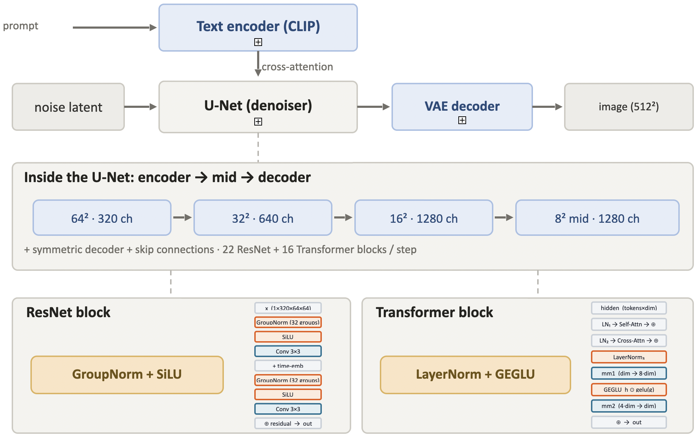

|

A prompt is first encoded into a text embedding by the *Text Encoder*.
The *U-Net* denoiser then uses that embedding to generate an image, running 22 ResNet blocks and 16 Transformer blocks on each denoising step.
Finally, the *VAE Decoder* maps the denoised output to the final RGB image.

The Hardware
------------

For the project we had access to a `DGX Spark <https://docs.nvidia.com/dgx/dgx-spark/hardware.html>`__, a compact machine built for local AI workloads.
It runs the NVIDIA GB10 Grace Blackwell Superchip with 128 GB of unified LPDDR5X memory at 273 GB/s, shared between the CPU and GPU.
The GPU has 48 Streaming Multiprocessors (SMs) and 24 MiB of L2 cache.

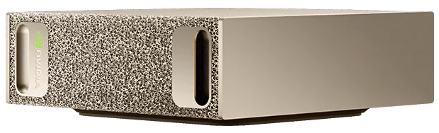

Our Milestones
--------------

We split the three-week project into six milestones:

0. Set up the environment and install required dependencies.
1. Inspect SD-Turbo, identify fusion candidates, reason about tiling, and build a roofline model.
2. Implement and optimize a fused GroupNorm + SiLU kernel.
3. Implement and optimize a fused LayerNorm + GEGLU FFN kernel.
4. Patch both kernels into SD-Turbo and verify end-to-end correctness.
5. Build a Gradio UI for running the optimized model on the DGX Spark.

Each milestone includes benchmarks against the eager PyTorch baseline and ``torch.compile``, across batch sizes and the full set of real U-Net shapes.

Milestone 0: SD-Turbo Model
---------------------------

The SD-Turbo pipeline needs a few libraries beyond a base PyTorch install.
``diffusers`` and ``transformers`` provide the model and text encoder; ``accelerate`` is a HuggingFace utility that suppresses dispatch warnings; ``torchvision`` handles image I/O.

.. code-block:: bash
    :caption: requirements

    pip install diffusers
    pip install transformers
    pip install accelerate
    pip install torchvision

Milestone 1: Fusion Candidates
-------------------------------

Before writing any kernels, we needed to find where fusion would actually pay off.
That meant inspecting the two main block types in the U-Net and building a roofline model to confirm which operations are worth targeting.
To see what ``torch.compile`` generates for each block, we used ``TORCH_LOGS=output_code``. 
We simply set it as an environment variable before compiling, which causes Inductor to print every kernel it emits to stdout.

The ResNet Block
^^^^^^^^^^^^^^^^^

Each ResNet block follows the same pattern: GroupNorm and SiLU, a 3×3 convolution that mixes information across neighboring pixels, a time-embedding step that injects the current noise level into the block, and then the same sequence again.
Finally, the block's input is added back to its output as a residual connection.

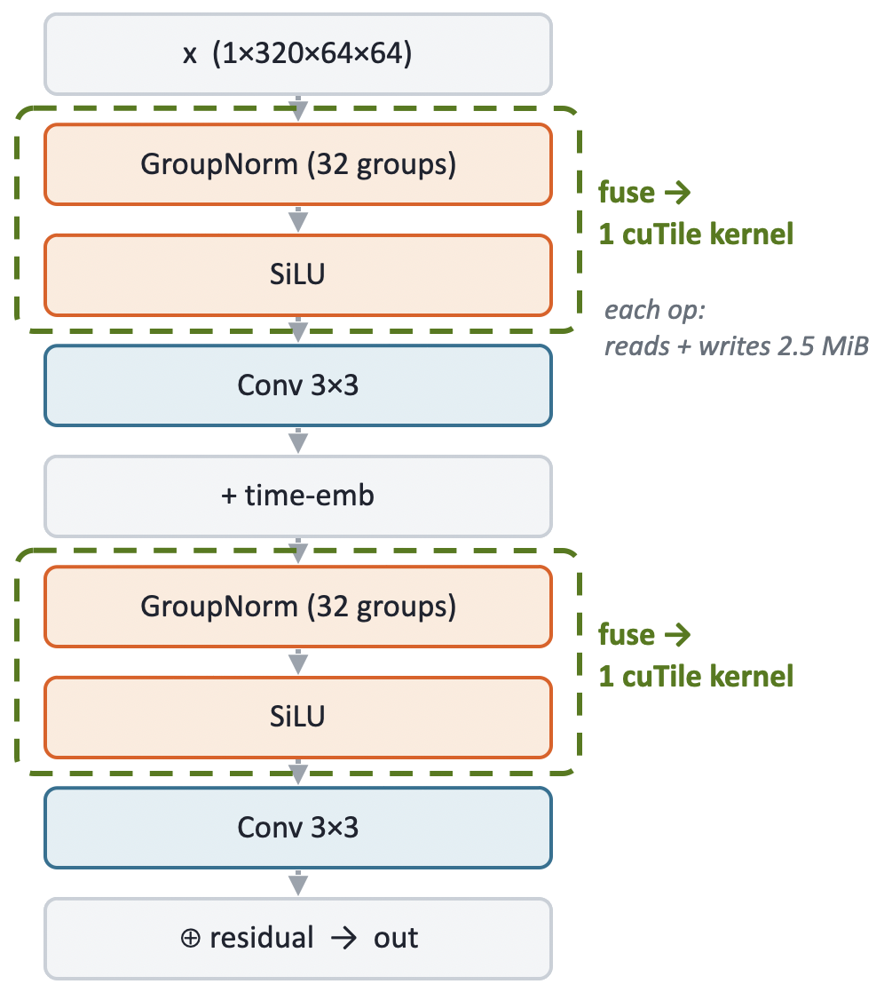

|

Two fusion candidates stand out: the GroupNorm + SiLU pairs before and after the time-embedding.
Running them as separate kernels means the full activation gets read and written twice per pair.
At the top resolution (320 channels, 64×64 spatial), that activation is 2.5 MiB, so each unfused pair costs an unnecessary 5 MiB of memory traffic.
Fusing both operations into a single kernel reduces that to one read and one write.

The activation sizes vary with U-Net depth.
As the network goes deeper, spatial resolution halves and channel count doubles at each step: 320 channels at 64×64, 640 at 32×32, 1280 at 16×16 and 8×8.
Fewer spatial locations, but each one carries a richer feature representation.
All of these shapes are candidates for the same fusion.

.. image:: ../_static/project/roofline.svg
   :alt: Roofline model
   :align: center
   :width: 80%

|

GroupNorm and SiLU both lie close to the memory bandwidth ceiling and well below the compute roof, which means that they are bandwidth-bound.
Fusing them reduces memory traffic without increasing compute requirements.

In the kernel log, eager PyTorch dispatches 4 separate kernels for the GN+SiLU block.
``torch.compile`` already fuses the normalization and activation down to 3.
Our cuTile kernel brings that to 2 (a stats pass and an apply pass), or 1 with a single-pass design.
That is the bar we are working against.

The Transformer Block
^^^^^^^^^^^^^^^^^^^^^

The transformer block takes a sequence of tokens as input, where each token corresponds to one spatial location.
In the model, tokens = height × width (the flattened spatial resolution from the previous ResNet layer) and dim = channels.

The block runs LayerNorm + self-attention and LayerNorm + cross-attention first.
Both attention operations appear as fused kernels in the log, leaving little room to improve.

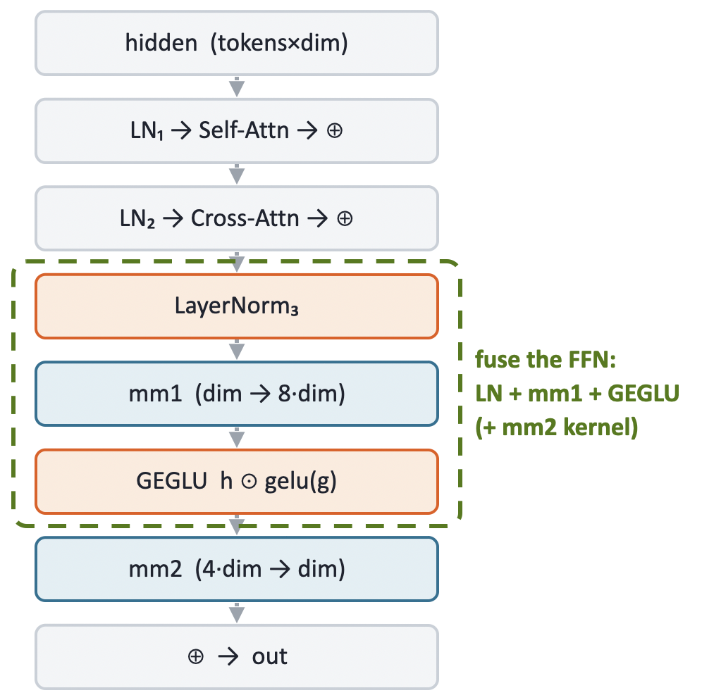

|

The feed-forward network at the end of the block is more promising.
The kernel log shows that Inductor emits the LayerNorm and the GEGLU gate as separate kernels, sandwiching two cuBLAS matmul calls:

::

    triton_..._native_layer_norm      # LayerNorm  (own kernel)
    extern_kernels.addmm              # mm1 (cuBLAS)
    triton_..._gelu_mul               # GEGLU gate (own kernel)
    extern_kernels.addmm              # mm2 (cuBLAS)

Because cuBLAS handles the matmuls, Inductor cannot fold LayerNorm or GEGLU into them.
The mm1 output is written to DRAM and read back by the gate kernel.

So the fusion is straightforward: use LayerNorm as a first touch going into mm1 and GEGLU as a last touch coming out of mm1, keeping the intermediate in registers and avoiding the DRAM round-trip entirely.

The feed-forward expansion factor is 4, and GEGLU requires two projections (hidden and gate), so mm1 projects from [tokens, dim] to [tokens, 8*dim] (this is the ``2*inner`` width we refer to in Milestone 3, with ``inner = 4*dim``).
At the top shape (tokens=4096, dim=320), that intermediate is 4096 × 2560 × 2 bytes (fp16) = 20 MiB.
Writing it to DRAM and reading it back costs 40 MiB per FFN call.
The fused kernel avoids that entirely.

Milestone 2: Fused GroupNorm + SiLU
-------------------------------------

The first kernel to implement is the GroupNorm + SiLU fusion for the ResNet blocks.
Before writing any cuTile code, it helps to understand what each operation computes and what data dependencies it creates.

GroupNorm and SiLU
^^^^^^^^^^^^^^^^^^^

GroupNorm normalizes each group of channels independently.
For each sample ``n`` and group ``g``, it computes the mean and variance over all channels and spatial locations in the group, then normalizes and applies a learned affine transform:

.. math::

    \mu_g = \frac{1}{C_g \cdot H \cdot W} \sum_{c \in g} \sum_{h,w} x_{n,c,h,w}

    \hat{x}_{n,c,h,w} = \frac{x_{n,c,h,w} - \mu_g}{\sqrt{\sigma_g^2 + \varepsilon}}

    y_{n,c,h,w} = \gamma_c \cdot \hat{x}_{n,c,h,w} + \beta_c

Stability AI fixed the number of groups at 32 during training, so with 320 channels each group covers exactly 10 channels.
The key constraint is that every element in the group must be read before any single element can be normalized, since mean and variance span the whole group. A two-pass design is the direct consequence: the first pass computes the statistics, the second applies them.

SiLU is simpler.
Each output element depends only on the corresponding input:

.. math::

    \text{SiLU}(x) = \frac{x}{1 + e^{-x}}

There is no cross-element dependency, which makes it a natural last touch to fuse onto the normalization apply pass.

The Two-Pass Kernel
^^^^^^^^^^^^^^^^^^^^

**Pass 1: stats kernel** -- grid of ``N * G = 32`` blocks, one per group.

Each block iterates over its ``channels_per_group = 10`` channels, accumulating the sum and sum-of-squares over the full H*W spatial extent.
From these it derives the group mean and inverse standard deviation, then stores them to DRAM for pass 2.

.. code-block:: python
    :caption: Stats kernel: mean and inverse std per group

    @ct.kernel
    def gn_mean_stddev_kernel(x, mean, std_dev,
                              channels_per_group: ConstInt,
                              height: ConstInt, width: ConstInt, eps):
        num_groups = mean.shape[1]
        bid        = ct.bid(0)
        group_idx  = bid % num_groups
        n          = bid // num_groups

        sum    = ct.zeros((1,), dtype=torch.float32)
        sum_sq = ct.zeros((1,), dtype=torch.float32)
        for channel_in_group in range(channels_per_group):
            channel_idx = group_idx * channels_per_group + channel_in_group
            flat    = ct.reshape(ct.load(x, index=(n, channel_idx, 0, 0),
                                 shape=(1, 1, height, width)).astype(torch.float32),
                                 (height * width,))
            sum    = sum    + ct.sum(flat,        axis=0)
            sum_sq = sum_sq + ct.sum(flat * flat, axis=0)

        count         = channels_per_group * height * width
        group_mean    = sum / count
        group_std_dev = ct.rsqrt(sum_sq / count - group_mean * group_mean + eps)

        ct.store(mean,    index=(n, group_idx), tile=ct.reshape(group_mean,    (1, 1)))
        ct.store(std_dev, index=(n, group_idx), tile=ct.reshape(group_std_dev, (1, 1)))

**Pass 2: apply kernel** -- grid of ``N * C = 320`` blocks, one per channel.

Each block loads the mean and inverse std for its group, applies normalization and the learned affine transform, then fuses SiLU as a final elementwise step.
A grid of 320 blocks fully covers the 48 SMs.

.. code-block:: python
    :caption: Apply kernel: normalize, affine, SiLU

    @ct.kernel
    def gn_silu_kernel(x, out, weight, bias, mean, std_dev,
                       channels_per_group: ConstInt,
                       height: ConstInt, width: ConstInt):
        bid         = ct.bid(0)
        channel_idx = bid % x.shape[1]
        sample_idx  = bid // x.shape[1]
        group_idx   = channel_idx // channels_per_group

        mean_s    = ct.reshape(ct.load(mean,    index=(sample_idx, group_idx), shape=(1, 1)), (1,))
        inv_std_s = ct.reshape(ct.load(std_dev, index=(sample_idx, group_idx), shape=(1, 1)), (1,))
        weight_s  = ct.load(weight, index=(channel_idx,), shape=(1,)).astype(torch.float32)
        bias_s    = ct.load(bias,   index=(channel_idx,), shape=(1,)).astype(torch.float32)

        x_fp32 = ct.reshape(ct.load(x, index=(sample_idx, channel_idx, 0, 0),
                             shape=(1, 1, height, width)).astype(torch.float32),
                             (height * width,))

        normed = (x_fp32 - mean_s) * inv_std_s
        affine = normed * weight_s + bias_s
        silu   = affine * (1.0 / (1.0 + ct.exp(-affine)))

        ct.store(out, index=(sample_idx, channel_idx, 0, 0),
                 tile=ct.reshape(silu.astype(out.dtype), (1, 1, height, width)))

The launch function allocates small intermediate buffers for the stats and fires both grids:

.. code-block:: python
    :caption: Launch grids

    grid1 = (N * num_groups, 1, 1)   #  32 blocks -- one per group
    grid2 = (N * C,          1, 1)   # 320 blocks -- one per channel

Alternative Approaches
^^^^^^^^^^^^^^^^^^^^^^^

We tried two other designs before settling on the two-pass kernel.

**Split-reduction variant**

The stats kernel launches only 32 blocks.
With 48 SMs on the DGX Spark, 16 stay idle, which is a waste of parallelism.
To fix this, we raised the stats grid to 320 blocks (one per channel) to compute partial sums per channel, and recombine them into group statistics inside the apply pass.

However, profiling disproved the hypothesis.
Raising the block count from 32 to 320 left memory throughput unchanged (6.73% -> 6.70%) and occupancy nearly flat (9.3% -> 11.5%).
The split apply pass even ran slower (19.2 us -> 23.4 us), because each apply block now has to load and sum 10 per-channel partial sums before it can normalize anything.
The clearest signal came from ``torch.compile`` itself: its apply kernel runs at 94.9% occupancy and still reaches only 15.7% memory throughput.
Therefore, the ceiling is not occupancy, but the problem size. A single batch-1 GroupNorm (2.5 MiB) does not supply enough parallel work to saturate the GPU.

**Single-pass variant**

The two-pass design has two costs: a kernel launch overhead for each pass, and a DRAM round-trip for the mean/inv_std buffers between them.
The single-pass kernel removes both: one launch, one block per group, statistics computed in registers and immediately reused to normalize all channels in the same block.

The trade-off is that ``x`` must be read twice, once to compute the statistics and once to normalize, because the full group (40,960 elements at the top shape) is too large to keep in registers across both loops.
We hoped the second read would mostly be served from L2 cache, since the stats loop had just touched the same data.

Benchmarks
^^^^^^^^^^^

Comparing all variants against eager and ``torch.compile`` on a single (1, 320, 64, 64) block (all times in microseconds):

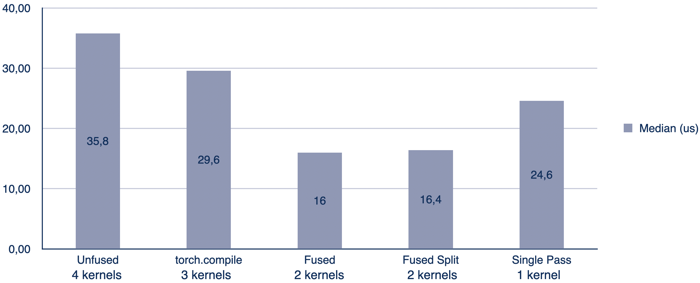

|

Both cuTile and ``torch.compile`` run at low memory throughput at batch 1. At 2.5 MiB the problem is latency-bound, not bandwidth-bound.
The two-pass kernel reaches a 1.85x speedup over ``torch.compile``; the win comes from launch overhead, not kernel efficiency.
Single-pass still beats torch.compile and unfused at batch 1, but trails the two-pass and split variants. Its grid of only 32 blocks leaves 16 of the 48 SMs idle, so the saved launch overhead is partially eaten by lower parallelism.

Sweeping the batch size makes the memory hierarchy visible (all times in microseconds).
Each image needs 5 MiB of working set (``x`` + ``out``), so the set crosses the 24 MiB L2 cache between B=1 (5 MiB, L2-resident) and B=8 (40 MiB, spills to DRAM):

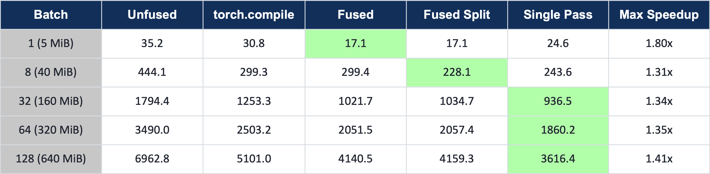

|

At B=1, the two-pass (Fused) kernel leads. Its 320 apply blocks fully cover the 48 SMs and, with only 2.5 MiB to process, launch overhead is the dominant cost.
At B=8, Fused-Split takes over as the working set spills to DRAM and the split variant's higher block count amortizes the cost better.
From B=32 onward, the single-pass kernel takes over.
The primary driver is intra-kernel cache reuse. Each block runs the stats loop and the apply loop in sequence, so the apply reads hit the L2 cache just primed by the stats pass rather than going back to DRAM.
The two-pass variant offers no such locality. Here the stats and apply kernels are separate launches with a global synchronization between them, so the apply kernel always reads ``x`` fresh from DRAM.

The measurements agree. At B=128, the theoretical DRAM bandwidth limit is roughly 3,690 µs (3 passes over 128 × 2.5 MiB at 273 GB/s); two-pass measures 4,140 µs (about 12% above the limit, i.e. ~243 GB/s effective), while single-pass measures 3,616 µs, below the theoretical limit.
The roofline assumes every byte is fetched from DRAM with no cache reuse, so measuring below it is direct evidence that the second read of ``x`` is partially served from L2.
The single-pass grid grows as ``batch * 32`` blocks, keeping the SMs well occupied, with one fewer kernel launch on top.
Across all batch sizes, at least one cuTile variant consistently outperforms ``torch.compile``, which dispatches more kernels and therefore pays more launch overhead.

The DRAM-bound plateau confirms the roofline prediction: reading ``x`` twice and writing ``out`` once costs
:math:`3 \times 2.5\,\text{MiB} / 273\,\text{GB/s} \approx 28.8\,\mu s` per image.

Shape coverage and the profitability gate
""""""""""""""""""""""""""""""""""""""""""

The U-Net has 44 GroupNorm calls across 14 distinct shapes.
Most shapes fall well within what the kernel handles efficiently:

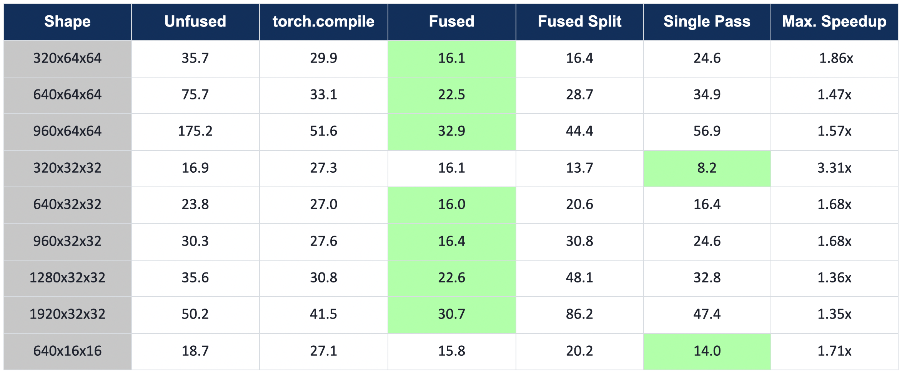

|

On the remaining high-channel, tiny-spatial shapes, the fusion advantage disappears.
The activations are small enough to fit entirely in L2 cache, so the memory traffic savings from fusion are negligible.
The culprit is work-per-block granularity. The apply kernel dispatches one block per channel, so at shapes like 2560×8×8 each block handles only 64 spatial elements, far too little to amortize per-block scheduling overhead.
Notably, the single-pass variant (one kernel launch) is slower than the two-pass variant (two launches), and both are slower than plain eager (four launches), the exact opposite of what kernel-launch count would predict, confirming that launch count is not the bottleneck.
PyTorch applies the normalization as a single flat elementwise pass over the whole tensor (a fused `TensorIterator <https://github.com/pytorch/pytorch/blob/main/aten/src/ATen/native/cuda/group_norm_kernel.cu>`__ kernel), so it stays fully occupied regardless of per-channel spatial size, and the cuTile kernel ends up slower than plain eager:

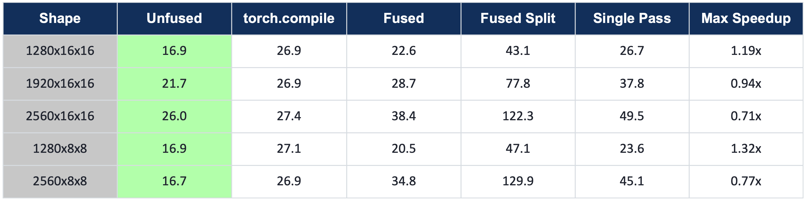

|

To avoid regressing those shapes, we added a ``_PROFITABLE_GN_SHAPES`` gate that activates the fused path only where it beats eager and falls back to PyTorch everywhere else.
The gate ensures the end-to-end patch is a net improvement and no shape is left slower than baseline.
The batch-1 wins are purely launch-overhead gains; ``torch.compile(mode="reduce-overhead")`` with CUDA graphs would erase them.
There is no kernel-level headroom left; further speed-up requires graph-level optimization.

Milestone 3: Fused LayerNorm + GEGLU FFN
------------------------------------------

The second candidate is the transformer feed-forward network.
Recall the target from Milestone 1: LayerNorm as a first touch into mm1, GEGLU as a last touch out of it, keeping the wide projection in registers instead of paying the 40 MiB DRAM round-trip.
Unlike GroupNorm + SiLU, this block is dominated by two matmuls rather than memory traffic.
Fusing away memory passes only helps when memory is the bottleneck, and here it usually is not.

LayerNorm and GEGLU
^^^^^^^^^^^^^^^^^^^

LayerNorm normalizes each token independently over its feature dimension.
For a token ``t``, that is one full row of the ``[tokens, dim]`` input:

.. math::

    \mu_t = \frac{1}{K} \sum_{k} x_{t,k}
    \qquad
    y_{t,k} = \frac{x_{t,k} - \mu_t}{\sqrt{\sigma_t^2 + \varepsilon}} \cdot \gamma_k + \beta_k

where ``K = dim`` is the feature width.
Every block still has to read all ``K`` columns of its rows before it can normalize a single element, since the mean and variance span the whole row.

GEGLU is the activation applied to the output of mm1.
The first matmul projects the normalized input to ``[tokens, 2*inner]``, twice the feed-forward width, which splits into two equal halves:

.. math::

    \text{hidden}, \text{gate} \in \mathbb{R}^{\text{tokens} \times \text{inner}}, \qquad \text{inner} = 4 \cdot \text{dim}

GELU is applied to the gate half, then the two halves are multiplied elementwise:

.. math::

    \text{GEGLU} = \text{hidden} \odot \text{GELU}(\text{gate})

cuTile has no ``erf``, so we use the tanh approximation of GELU:

.. math::

    \text{GELU}(x) \approx 0.5\,x \left(1 + \tanh\!\left(\sqrt{2/\pi}\,(x + 0.044715\,x^3)\right)\right)

The final gated output is ``[tokens, inner]``, exactly the input width the second matmul expects.

The Fused Kernel
^^^^^^^^^^^^^^^^

As with the ResNet kernel, we fixed a reference shape to design against: ``[1, 4096, 320]``.
The launch side is straightforward.
We reshaped ``x`` to ``[M, dim]``, transposed ``w1`` to ``[dim, 2*inner]`` so the weight tiles load directly, allocated the ``gated`` output buffer, and computed the grid.
Because the kernel is tiled, the grid is the number of output tiles: row-tiles times column-tiles.

.. code-block:: python
    :caption: Launch grid for Kernel A

    gridA = (ct.cdiv(M, tM) * ct.cdiv(inner, tN), 1, 1)   # row-tiles x col-tiles

Note that the grid is sized by the matmul output, not by LayerNorm.
The kernel itself runs LayerNorm, mm1, and GEGLU in a single pass per block, using two K-loops:

.. code-block:: python
    :caption: Kernel A: LayerNorm first touch, mm1, GEGLU last touch

    @ct.kernel
    def ffn_mm1_geglu(x, w1t, b1, ln_weight, ln_bias, gated,
                      tM: ConstInt, tN: ConstInt, tK: ConstInt, eps):
        K           = x.shape[1]          # contraction dim (e.g. 320)
        inner       = gated.shape[1]      # output width after GEGLU (e.g. 1280)
        num_tiles_n = ct.cdiv(inner, tN)

        bid    = ct.bid(0)
        n_tile = bid % num_tiles_n
        m_tile = bid // num_tiles_n

        # Loop 1: per-row LayerNorm statistics over the feature dim K
        row_sum = ct.zeros((tM,), dtype=torch.float32)
        row_sq  = ct.zeros((tM,), dtype=torch.float32)
        for k in range(ct.cdiv(K, tK)):
            xt = ct.load(x, index=(m_tile, k), shape=(tM, tK)).astype(torch.float32)
            row_sum = row_sum + ct.sum(xt,      axis=1)
            row_sq  = row_sq  + ct.sum(xt * xt, axis=1)
        mean_1d = row_sum / K
        mean    = ct.reshape(mean_1d, (tM, 1))
        inv_std = ct.reshape(ct.rsqrt(row_sq / K - mean_1d * mean_1d + eps), (tM, 1))

        # Loop 2: normalize + affine, accumulate hidden and gate halves together
        acc_hidden = ct.zeros((tM, tN), dtype=torch.float32)
        acc_gate   = ct.zeros((tM, tN), dtype=torch.float32)
        for k in range(ct.cdiv(K, tK)):
            xt = ct.load(x, index=(m_tile, k), shape=(tM, tK)).astype(torch.float32)
            lw = ct.load(ln_weight, index=(k,), shape=(tK,)).astype(torch.float32)
            lb = ct.load(ln_bias,   index=(k,), shape=(tK,)).astype(torch.float32)
            normed = ((xt - mean) * inv_std * lw + lb).astype(torch.float16)

            w_hidden = ct.load(w1t, index=(k, n_tile),               shape=(tK, tN))
            w_gate   = ct.load(w1t, index=(k, n_tile + num_tiles_n), shape=(tK, tN))
            acc_hidden = ct.mma(normed, w_hidden, acc_hidden)
            acc_gate   = ct.mma(normed, w_gate,   acc_gate)

        # GEGLU last touch: hidden * GELU(gate)
        hidden = acc_hidden + ct.load(b1, index=(n_tile,),               shape=(tN,)).astype(torch.float32)
        gate   = acc_gate   + ct.load(b1, index=(n_tile + num_tiles_n,), shape=(tN,)).astype(torch.float32)
        gelu   = 0.5 * gate * (1.0 + ct.tanh(0.7978845608 * (gate + 0.044715 * gate * gate * gate)))
        ct.store(gated, index=(m_tile, n_tile), tile=(hidden * gelu).astype(gated.dtype))

The first loop computes one mean and inverse standard deviation per row of the tile.
The second loop normalizes each input tile and immediately feeds it into two matmul accumulators, ``acc_hidden`` and ``acc_gate``, one for each half of ``w1``.
Keeping both accumulators live means the normalized input is reused for both projections without ever writing the ``2*inner`` intermediate to memory.
After the loop, the bias is added and GEGLU produces the gated output directly.

For the second matmul we did not write a cuTile kernel at all.
A plain ``F.linear(gated, w2, b2)`` (which dispatches to cuBLAS) was faster than anything we could tile by hand.
So we fused the first matmul but left the second to cuBLAS. The benchmarks below show why.

Alternative Approaches
^^^^^^^^^^^^^^^^^^^^^^^

**Split variant**

The fused kernel keeps two accumulators alive across the whole reduction.
The split variant instead computes the two halves in separate kernels: one for hidden, one for gate plus GEGLU, materializing the hidden buffer in between.
The cost is that each kernel recomputes the LayerNorm statistics from scratch, so the reduction runs twice, and the hidden buffer makes an extra DRAM round-trip.

**Swizzle variant**

The swizzle variant reorders how blocks are scheduled.
Instead of walking output tiles row by row, it groups ``GROUP_M = 8`` row-tiles together so that blocks running concurrently touch the same weight columns, which keeps those columns hot in L2.
This is purely a scheduling change; the math inside the kernel is identical to the fused version.

Benchmarks
^^^^^^^^^^^

Before comparing variants, we swept the tile shape to find the best ``(tM, tN, tK)`` for the reference shape.
All three cuTile variants prefer the same tile: ``tM = 128``, ``tN = tK = 64``.

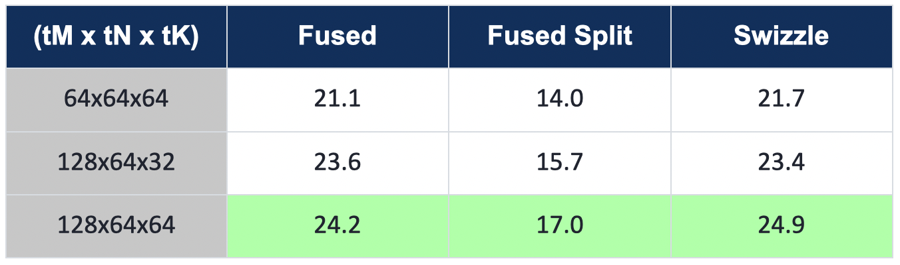

|

With that tile fixed, here are the runtimes on the reference shape ``(1, 4096, 320)`` (all times in microseconds, lower is better):

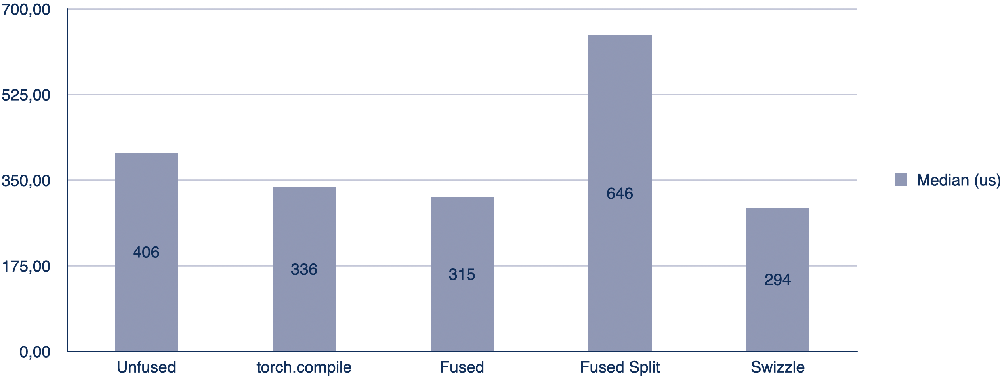

|

The swizzle variant is the best, reaching a 1.14x speedup over ``torch.compile``.
This is the same effect we saw in Milestone 1. Fusing LayerNorm and GEGLU into mm1 avoids the wide-projection round-trip that ``torch.compile`` cannot, so we move less data.

This is the only shape where we come out ahead.
Extending the comparison to all four FFN shapes in the U-Net shows where the fusion breaks down:

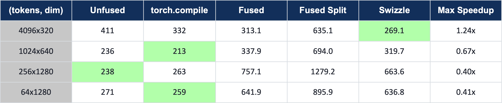

|

We only win on ``4096 × 320``, and lose on the other three, often badly.
The trade-off is between two competing effects:

- **Larger dim** means the matmul takes up more of the total work. Our hand-written mm1 is a much weaker GEMM than cuBLAS, so as the matmul share grows, we lose more ground to ``torch.compile``.
- **More tokens** means more data to move, which is exactly where the avoided round-trip pays off, so our kernel does relatively better.

``4096 × 320`` is the one shape where the token count is high and the dim is low, making it the only memory-bound FFN shape. Everywhere else the matmul dominates and cuBLAS wins. On those shapes we are slower than plain eager too, not just ``torch.compile``.

As with the ResNet kernel, we added a profitability gate. We fuse only the ``dim = 320`` shape and leave the rest to the original PyTorch path.
This follows from the roofline argument. Fusion helps when a block is memory-bound, and hurts when it is compute-bound, because there cuBLAS already handles the matmul far better than our hand-written kernel.

Milestone 4: End-to-End Evaluation
------------------------------------

With both kernels built and gated, the last step is to drop them into the real U-Net and time a full image generation.
The question is whether the per-kernel wins from the last two milestones still show up once the kernels are only a small part of a much larger model.

Patching the U-Net
^^^^^^^^^^^^^^^^^^^

The two patches work in-place on a loaded model, walking the module tree and swapping the relevant submodules.

The ResNet patch replaces both GroupNorms in each block with a ``GnSiluFused`` module that folds in the SiLU, then rebinds the block's ``forward`` so the now-redundant SiLU calls after each norm are dropped.

.. code-block:: python
    :caption: Patching a ResNet block

    def patch_resnet_block(block: ResnetBlock2D) -> ResnetBlock2D:
        block.norm1 = GnSiluFused(block.norm1)   # GroupNorm + SiLU fused
        block.norm2 = GnSiluFused(block.norm2)
        # rebind forward so the separate SiLU activations are no longer applied
        block.forward = types.MethodType(_fused_forward, block)
        return block

The FFN patch uses a small trick.
Each transformer block computes ``ff(norm3(x))``, and our kernel already folds the LayerNorm in.
So we replaced ``norm3`` with an identity and ``ff`` with the fused module, which makes ``ff(norm3(x))`` collapse to the fused kernel on the raw input, leaving the block's residual structure untouched.

.. code-block:: python
    :caption: Patching a transformer FFN

    def patch_ffn_block(block: BasicTransformerBlock) -> BasicTransformerBlock:
        # ff(norm3(x)) becomes FusedFFN(x); the kernel folds LayerNorm in itself
        block.ff    = FusedFFN(block.norm3, block.ff)
        block.norm3 = nn.Identity()
        return block

Both fused modules keep the profitability gates from the earlier milestones.
``GnSiluFused`` only runs the kernel on the nine beat-eager shapes (and picks the single-pass variant once the batch reaches 3), while ``FusedFFN`` only fires on ``dim = 320``.
Every other shape falls back to the original PyTorch path, so the patched model can never be slower than eager on an unsupported block.

Before benchmarking, we confirmed the patched pipeline still produces the right image.
The generated output matches the eager baseline, with the FFN's tanh-GELU approximation introducing a slightly larger but visually indistinguishable difference.

Results
^^^^^^^

First, a single generation at batch 1 (median milliseconds, lower is better):

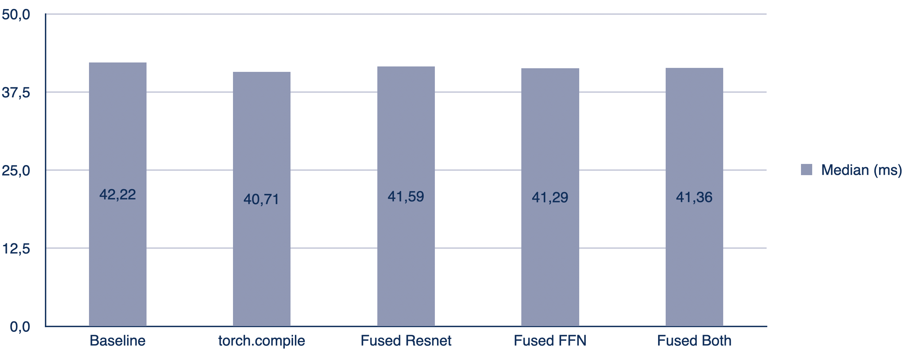

|

Every fused variant is within one to two percent of the eager baseline, and ``torch.compile`` is the fastest.
This is what we expected.
GroupNorm and the FFN are only a small part of the roughly 42 ms step, and the convolutions, attention, and VAE take up most of the rest.
A kernel that runs twice as fast on its own changes the total by maybe a percent, which is well inside the run-to-run noise.

Across different batch sizes, the results differ:

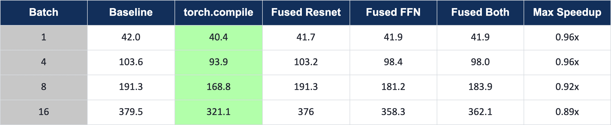

|

From batch 4 onward, the fused FFN and the combined patch are a few percent faster than the baseline (98.0 ms versus 103.6 ms at batch 4, and 358 ms versus 380 ms at batch 16).
Almost all of that comes from the FFN.
As the batch grows, the token count of the ``4096 × 320`` shape grows with it, which pushes that shape further into the memory-bound regime where the fusion helps, the same effect we saw in Milestone 3.
The ResNet patch stays about neutral, which makes sense given how small the GroupNorm part is.

``torch.compile`` is still faster at every batch size, and its lead grows with the batch (from about 4 percent at batch 1 to 15 percent at batch 16).
This depends on how much of the model each approach touches.
Our patches only swap two block types and leave the rest of the model running eager, while ``torch.compile`` optimizes the whole graph and captures it into CUDA graphs, which removes the per-launch overhead the patched pipeline still pays on every convolution and attention call.

The gates prevent regressions. The patch matches the baseline at batch 1 and is a little faster at larger batches.
But the end-to-end number is still decided by the parts of the model we left alone.
To close the gap to ``torch.compile`` we would need to capture the whole fused pipeline into a CUDA graph, rather than write faster individual kernels.

Milestone 5: Gradio UI
----------------------

As a final deliverable, we wrapped the optimized pipeline in a small `Gradio <https://www.gradio.app/>`__ app.
Gradio is a Python library that turns a function into a web UI, so the interface runs in the browser while the model itself runs on the DGX Spark.

The UI takes a text prompt and a seed, with a button to randomize the seed and a checkbox to switch the fused kernels on or off.
Pressing *Generate* runs one denoising step and shows the resulting image next to the controls.
The fused checkbox applies both patches from Milestone 4, which makes it easy to compare the fused and baseline outputs on the same prompt.

|

The app can be started with:

.. code-block:: bash

    python src/diffusion/app.py

Gradio then prints a local URL that opens the interface in the browser.

Running the Project
-------------------

This section collects the commands for running the model, the tests, and the benchmarks.
Everything that touches a cuTile kernel needs a CUDA GPU.
Any recent one works, but the kernels and their profitability gates were tuned for the DGX Spark, as explained in the milestones, so the exact speedups will differ on other hardware.

Running the Model
^^^^^^^^^^^^^^^^^

``main.py`` loads SD-Turbo, optionally patches in the fused kernels, and generates a single image.
It takes a few command-line parameters:

.. list-table::
   :header-rows: 1

   * - Parameter
     - Default
     - Description
   * - ``--prompt``
     - ``"Will Smith eating spaghetti"``
     - Text prompt for the image.
   * - ``--seed``
     - ``0``
     - Random seed for generation.
   * - ``--out-dir``
     - ``diffusion/outputs``
     - Directory the generated image is written to.
   * - ``--fused`` / ``--no-fused``
     - ``--fused``
     - Patch the U-Net with the fused GN+SiLU and LN+GEGLU kernels.
   * - ``--inspect``
     - off
     - Print the U-Net structure and layer information after generating.

.. code-block:: bash
    :caption: Running the model

    # default: fused kernels on, seed 0
    python src/diffusion/main.py

    # custom prompt and seed
    python src/diffusion/main.py --prompt "a red bicycle on a beach" --seed 42

    # run the unpatched baseline
    python src/diffusion/main.py --no-fused

The Gradio UI from Milestone 5 is the interactive alternative:

.. code-block:: bash

    python src/diffusion/app.py

Running the Tests
^^^^^^^^^^^^^^^^^

The tests verify that each fused kernel matches its PyTorch reference.
They run with ``pytest``, which picks up the source paths from ``pyproject.toml``, so no extra setup is needed:

.. code-block:: bash
    :caption: Running tests

    # all tests
    python -m pytest

    # a single test file
    python -m pytest test/diffusion/sd_turbo_fused/resnet/test_kernel_shapes.py -v

    # all tests matching a keyword
    python -m pytest -k gn_silu -v

Running the Benchmarks
^^^^^^^^^^^^^^^^^^^^^^^

The benchmark scripts compare the fused kernels against eager PyTorch and ``torch.compile``, and produce the numbers shown in the milestones above.
Unlike the tests, they are plain scripts, so the source paths have to be on ``PYTHONPATH``:

.. code-block:: bash
    :caption: Running benchmarks

    export PYTHONPATH=src/diffusion:test/diffusion

    # GroupNorm + SiLU (Milestone 2)
    python test/diffusion/benchmarks/bench_gn_silu.py

    # LayerNorm + GEGLU and the full FFN (Milestone 3)
    python test/diffusion/benchmarks/bench_ln_geglu.py
    python test/diffusion/benchmarks/bench_ffn.py

    # end-to-end U-Net (Milestone 4)
    python test/diffusion/benchmarks/bench_e2e.py

Takeaways
---------

Three weeks of kernel work showed us where hand-written fusion helps and where it does not:

- **What worked.** Fusing memory-bound operations pays off exactly where the roofline predicts. The GN+SiLU kernel beats ``torch.compile`` across every batch size, and the fused FFN wins on the one memory-bound shape (``4096 × 320``), pulling the end-to-end model a few percent ahead of eager from batch 4 onward.
- **What didn't.** Fusion hurts as soon as a block is compute-bound. On high-channel GroupNorm shapes and every FFN shape with a larger ``dim``, our hand-written matmul cannot compete with cuBLAS, so we gate those shapes back to PyTorch. Occupancy tricks (the split-reduction variant) made no measurable difference, because the real limit was problem size, not parallelism.
- **What we'd do next.** The remaining gap to ``torch.compile`` is not kernel efficiency but launch overhead. Closing it requires capturing the whole fused pipeline into a CUDA graph, i.e. a graph-level optimization rather than faster individual kernels.
