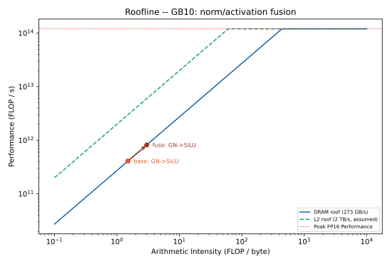

Project: cuTile for Local Diffusion
===================================

For the last three weeks of the machine-learning-accelerators course, we ought to select a personal project.
We have decided to optimize the denoising loop of a local text-to-image diffusion model.

As our model of choice we have selected the ``SD-Turbo`` text-to-image model.
The architecture of ``SD-Turbo`` is a U-Net.

Each denoising step runs the whole U-Net, which, for the ``SD-Turbo`` is built from 22 ResnetBlocks (and 16 transformer blocks).
For our selected model, the operations within such a block are:

- GroupNorm,
- SiLU,
- Conv2d, and
- Linear.

Further, on the transformer side there are:

- LayerNorm,
- GELU / GEGLU FFN, and
- the attention mechanism.

Looking at these operations it becomes clear that there are a lot of memory transfers happening.
Therefore, we plan to decrease the text-to-image time by fusing together several of these operations.
That means we are optimizing the diffusion model in regards to memory bandwidth.

Milestones
----------

To follow a clear plan for these three weeks we came up with five milestones.

0. Inspect SD-Turbo model in regards to memory requirements and realization on the DGX Spark GPU (Roofline model).
1. Reason about fusing candidates (layers) and tiling approaches.
2. Implement fusion kernel for two candidates (+ verify correctness via ``torch.allclose`` per block and benchmark).
3. Include the optimized kernel into the SD-Turbo model (+ verify end-to-end image equivalence).
4. Optimize the first candidate.
5. Repeat for the next candidate (Step 2).
6. Create CLI, Gradio UI to use the optimized model on the DGX Spark.

In regards to benchmarking we plan to:

- compare against ``torch.compile``,
- prove the approach with Nsight (bytes moved per step at each memory tier)
- keep track on the gain of each of our fusing approaches, and
- compare different tiling sizes and approaches.

Milestone 0: SD-Turbo Model
---------------------------

Additional requirements that are needed to generate images with the ``SD-Turbo`` model.

.. code-block:: bash
    :caption: requirements

    pip install diffusers
    pip install transformers
    # Silence warnings
    pip install accelerate
    pip install torchvision

Milestone 1: Candidates + Tiling
--------------------------------

After installing the required libraries, we then inspected a resnet and a transformer block of the model.

Resnet Block
^^^^^^^^^^^^^^

.. literalinclude:: ../_static/resnet.txt
    :language: text
    :caption: ResnetBlock2D

Based on this resnet-block it is clear that each operation (norm, SiLU) reads and writes :math:`2 \cdot 320 \cdot 64 \cdot 64 = 2.5MiB`.
Therefore, the clear candidates for a fusion are ``norm1 + SiLU`` and ``norm2 + SiLU``.
To achieve the highest performance for the resnet block, it is also possible to additionally fuse the denoising (``temb``) and the residual tail.

The roofline model shows that the norm / activation operations are memory-bound, so fusing ``norm + SiLU`` makes sense.

Transformer Block
^^^^^^^^^^^^^^^^^

.. literalinclude:: ../_static/transformer.txt
    :language: text
    :caption: Transformer2DModel

For the transformer block, the ``LayerNorm + GEGLU`` are worth fusing with the matrix multiplications.

- ``LayerNorm -> mm1 (320, 2560) -> GEGLU -> mm2 (1280, 320)``

By fusing these operations, we plan to remove the separated memory passes for ``LayerNorm + GEGLU``.

Fusing
^^^^^^

After performing some initial tests, we verified that ``torch.compile`` already fuses ``norm + SiLU`` into a single kernel.
Therefore, this kernel serves as a warm-up kernel.

On the other hand, the ``Layernorm`` and ``GEGLU`` are executed as two separate kernels.
Therefore, fusing them with the matmul provides higher value compared to the ``torch.compile`` reference.

Tiling
^^^^^^

For the optimal tiling approach we have several constraints that have to be met, either from cuTile or the GPU.

From the cuTile side of things, we have to consider that the tile dimensions must be powers of two.

The Nvidia Spark GPU has ``24 MiB`` of L2 cache and ``48 SMs``.
The per-block activation (``2.5 MiB``) fits comfortably in L2, so at batch 1 it stays cache-resident.

For the ``norm + SiLU`` fusion we are looking at 32 groups and 320 channels.
Therefore, we can use 10 channels per group and thereby, have :math:`10 \times 64 \times 64 = 40,960` elements.

For the fusion of the matmul with the ``LayerNorm + GEGLU``, we keep the contraction pattern of the two linear layers with ``(320 -> 2560, 1280 -> 320)``.
We are going to fuse the ``LayerNorm`` as a first touch and then apply the ``GELU`` as a last touch for the first matmul.

Milestone 2: Fused GroupNorm + SiLU Kernel
------------------------------------------

GroupNorm Shape Coverage
^^^^^^^^^^^^^^^^^^^^^^^^^

A forward-pass survey of all 44 GroupNorm calls across the U-Net's ``ResnetBlock2D`` blocks reveals 14 distinct ``(channels, H, W, groups)`` shapes, of which the fused cuTile kernel currently serves only the ``(320, 64, 64, 32)`` case (16 % of calls).
Because the kernel is already shape-parametric -- the channel count is only a loop bound and every spatial extent is a power of two -- all 44 calls are kernel-eligible, so full coverage requires merely relaxing the ``GnSiluFused._is_supported`` gate rather than writing new kernels.

::

     chan    H    W  grps   Cg  count   now eligible
    ----------------------------------------------------
     1280    8    8    32   40     11            YES
      320   64   64    32   10      7   YES      YES
      640   32   32    32   20      6            YES
     1280   16   16    32   40      6            YES
     2560    8    8    32   80      3            YES
      640   64   64    32   20      2            YES
     2560   16   16    32   80      2            YES
      320   32   32    32   10      1            YES
      640   16   16    32   20      1            YES
      960   32   32    32   30      1            YES
      960   64   64    32   30      1            YES
     1280   32   32    32   40      1            YES
     1920   16   16    32   60      1            YES
     1920   32   32    32   60      1            YES
    ----------------------------------------------------
    total GN calls: 44   fused now: 7 (16%)   kernel-eligible: 44 (100%)
    distinct shapes: 14

After we applied the arbitrary shapes, we are now fusing everything:

::

     chan    H    W  grps   Cg  count   fusable
    --------------------------------------------
     1280    8    8    32   40     11       YES
      320   64   64    32   10      7       YES
      640   32   32    32   20      6       YES
     1280   16   16    32   40      6       YES
     2560    8    8    32   80      3       YES
      640   64   64    32   20      2       YES
     2560   16   16    32   80      2       YES
      320   32   32    32   10      1       YES
      640   16   16    32   20      1       YES
      960   32   32    32   30      1       YES
      960   64   64    32   30      1       YES
     1280   32   32    32   40      1       YES
     1920   16   16    32   60      1       YES
     1920   32   32    32   60      1       YES
    --------------------------------------------
    total GN calls: 44   fusable: 44 (100%)
    distinct shapes: 14

Kernel Benchmark and Profiling
^^^^^^^^^^^^^^^^^^^^^^^^^^^^^^^

We compared the fused cuTile ``GroupNorm + SiLU`` against the eager PyTorch reference and
``torch.compile`` on a single ``(1, 320, 64, 64)`` block, and profiled every kernel with
Nsight Compute (``ncu``).

.. list-table:: GroupNorm + SiLU on (1, 320, 64, 64), profiled with Nsight Compute
   :header-rows: 1

   * - Variant
     - Kernels
     - Total (us)
     - Memory throughput
   * - eager (reference)
     - 4
     - ~104
     - 2 - 19 %
   * - ``torch.compile``
     - 3
     - ~41
     - 0.5 - 16 %
   * - fused (cuTile)
     - 2
     - ~39
     - 6 - 14 %

At the kernel level the cuTile fusion matches ``torch.compile`` (two kernels vs three) and both
plateau at a low memory throughput: a single batch-1 ``GroupNorm`` is too small to saturate the
48 SMs, so the kernels are latency-bound, not bandwidth-bound. The larger speed-up seen in the
Python micro-benchmark is dominated by ``torch.compile``'s per-call dispatch overhead rather than
kernel efficiency. End-to-end, ``torch.compile`` additionally optimizes the whole U-Net graph
(CUDA graphs, cross-kernel scheduling), which a per-block kernel replacement does not -- so the
end-to-end difference reflects graph-level optimization, not the quality of the
``GroupNorm + SiLU`` kernel.

Occupancy is not the bottleneck
"""""""""""""""""""""""""""""""

The statistics kernel launches only ``N x groups = 32`` blocks, so we suspected it underfilled the
48 SMs and wrote a split-reduction variant: per-channel partial sums (``N x channels = 320`` blocks)
recombined in the apply pass. **Profiling disproved the hypothesis.** Raising the block count 32 -> 320
left the memory throughput unchanged (6.73 % -> 6.70 %) and the achieved occupancy nearly flat
(9.3 % -> 11.5 %); the split apply pass even ran *slower* (19.2 -> 23.4 us) because rebuilding the
group statistics per block adds dependent scalar loads. The decisive evidence comes from
``torch.compile``: its apply kernel runs at **94.9 % occupancy and still reaches only 15.7 % memory
throughput**. The ceiling is therefore the *problem size* -- a single batch-1 ``GroupNorm`` (2.5 MiB,
~19 us) cannot supply enough parallel work to saturate the GPU -- not the launch occupancy. The
simple two-pass kernel remains the fastest variant; the split kernel is kept as a documented negative
result. Further speed-ups must come from graph-level optimization (CUDA graphs) or larger batches,
not from tuning this kernel. Sweeping the batch size confirms this is scale-independent: the
split-reduction kernel stays within ~2 % of the two-pass kernel from ``B = 1`` to ``B = 128``
(``split / two-pass`` = 0.98 - 1.01), so raising occupancy is neutral across the whole L2-to-DRAM
range, not only at batch 1.

Batch scaling: the L2 boundary
""""""""""""""""""""""""""""""

Sweeping the batch size makes the memory hierarchy directly visible. Each image needs
``x`` + ``out`` = ``2 x 2.5 MiB = 5 MiB`` of working set, so the set crosses the ``24 MiB`` L2 cache
between ``B = 4`` (20 MiB, fits) and ``B = 8`` (40 MiB, spills to DRAM):

.. list-table:: Fused GroupNorm + SiLU, per-image latency vs batch size
   :header-rows: 1

   * - Batch
     - us / call
     - us / image
     - Regime
   * - 1
     - 17.7
     - 17.7
     - L2-resident
   * - 2
     - 24.2
     - 12.1
     - L2-resident
   * - 4
     - 59.1
     - 14.8
     - L2-resident (near limit)
   * - 8
     - 238.7
     - 29.8
     - spills to DRAM
   * - 16
     - 536.0
     - 33.5
     - DRAM-bound
   * - 32
     - 1046.0
     - 32.7
     - DRAM-bound
   * - 64
     - 2092.5
     - 32.7
     - DRAM-bound

While the working set is L2-resident the per-image latency stays ~12 - 18 us (latency-bound); once it
spills, it plateaus at ~32.7 us/image. That plateau is exactly the DRAM-bandwidth cost of the two-pass
kernel, which moves ``x`` twice plus ``out`` once: :math:`3 \times 2.5\,\text{MiB} / 240\,\text{GB/s} \approx 32.8\,\mu s`.
This confirms the roofline premise from Milestone 1: at batch 1 the activation is L2-resident (so the
fusion win is L2 traffic and launch overhead), and only at larger batch / resolution does it spill to
DRAM, where reducing the number of passes would yield the larger, bandwidth-bound win.

cuTile vs. torch.compile across batch sizes
"""""""""""""""""""""""""""""""""""""""""""

Comparing the fused cuTile kernel against ``torch.compile`` on random inputs across batch sizes
separates the two regimes cleanly:

.. list-table:: Median latency (us), fused GroupNorm + SiLU on random data
   :header-rows: 1

   * - Batch
     - Working set
     - ``torch.compile``
     - cuTile
     - cuTile vs compile
   * - 1
     - 5 MiB (L2)
     - 29.8
     - 15.7
     - 1.90x
   * - 8
     - 40 MiB (DRAM)
     - 225.1
     - 260.4
     - 0.86x
   * - 32
     - 160 MiB (DRAM)
     - 1006.1
     - 1075.8
     - 0.94x
   * - 64
     - 320 MiB (DRAM)
     - 1996.0
     - 2044.2
     - 0.98x
   * - 128
     - 640 MiB (DRAM)
     - 3995.4
     - 4067.1
     - 0.98x

At batch 1 cuTile is 1.90x faster, but this is a *launch-overhead* win: cuTile issues two kernels via a
light launch path, whereas default-mode ``torch.compile`` issues three with Python dispatch guards. Once
the working set spills to DRAM both kernels become bandwidth-bound -- they move the same bytes against the
same ~240 GB/s roof -- so the ratio converges toward a tie (0.86 -> 0.98), the two implementations landing
within a few percent of each other. The conclusion: for this memory-bound operation the cuTile kernel *matches* a
heavily tuned production compiler to within ~10 %; its only clear advantage is launch overhead at batch 1,
which ``torch.compile(mode="reduce-overhead")`` (CUDA graphs) would also remove. This closes the
``GroupNorm + SiLU`` candidate: there is no kernel-level headroom left, so the remaining gains must come
from graph-level launch amortization (CUDA graphs) and from the compute-bound transformer FFN candidate.

Test Execution
==============

.. code-block:: bash
    :caption: Test Execution

    export PYTHONPATH=src/diffusion:test/diffusion
    python -m pytest test/diffusion/sd_turbo_fused/resnet/test_kernel_shapes.py -v